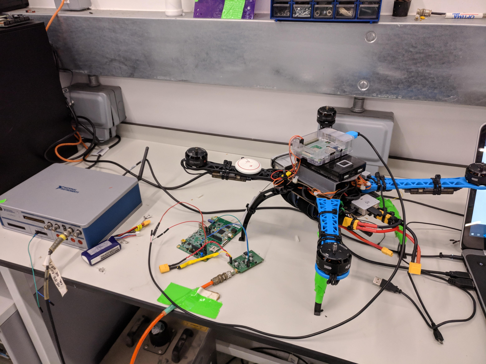
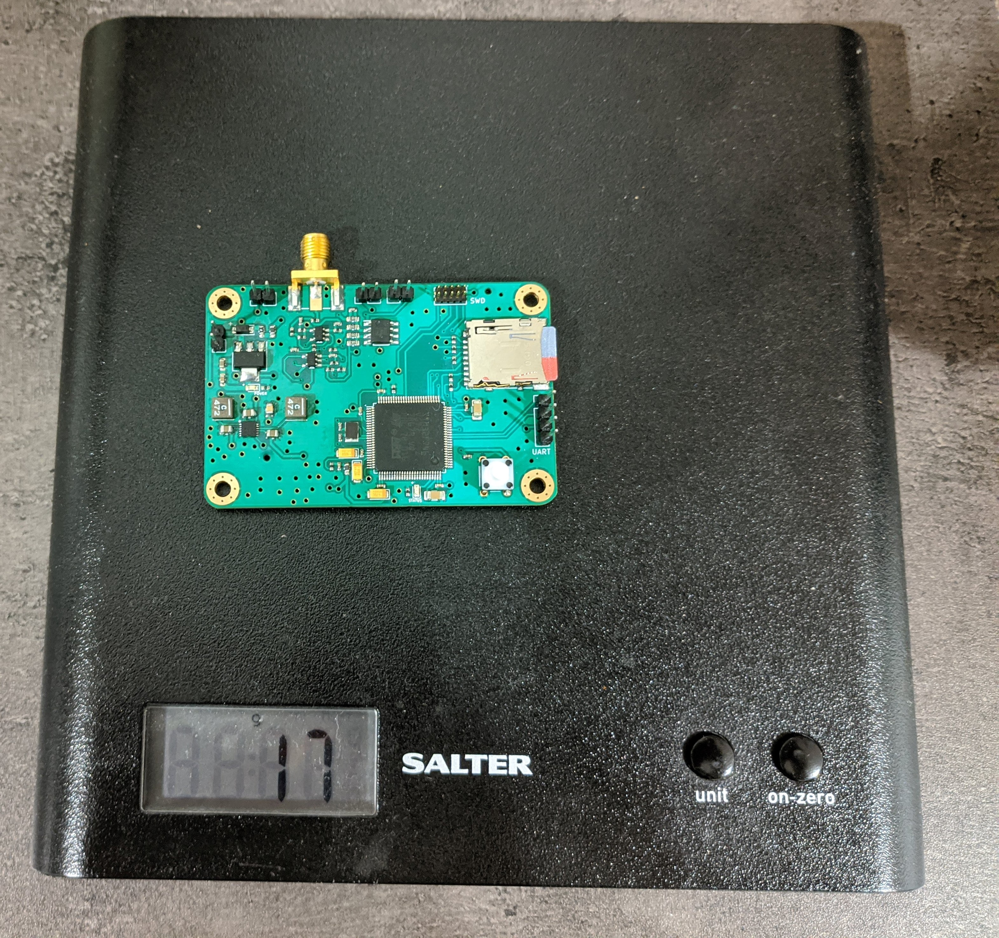

# PorpDAQ
STM32F7 Based design data acquisition recorder for harbour porpoises. The system is based on a STM32F7 Microcontroller with a 40dB bandpass preamplifier (90Khz - 150kHz). Records WAV file at a sampling rate of 400 KHz and stores them to a microSD card. The preamplifier was designed using TI's filter designer tool. Preamp output is passed to a summing amplifier to keep signals within 0 - 3.3V with a 1.65V bias. There's a few iterations of the DAQ from the initial prototypes to improved designs. 

PorpDAQ has been designed to fit within a small multirotor UAV so current design weighs only 18g. PorpDAQ computes a 1024 point RFFT of incoming hydrophone signals and transmits signals within 90 - 150KHz over a UART Interface. 

## Rev 1
This version used the STM32F7 discovery board connected with the Preamp PCB. The screen on the Board was removed to reduce weight and remove some parasitics which was present in the inout signals

## Rev 2
Custom PCB based on STM32f746 100-pin LQFP. Some improvements were also made to the power delivery. 

This repository mostly contains of:
   - Hardware designs for the different revisions (circuits were simulated in MultiSim and designs were made in UltiBoard and Kicad)
   -  Low level drivers and firmware (bare-metal version and FreeRTOS version for both boards)

## Structure
 - Firmware: Contains Custom Board FreeRTOS firmware and STM32f7 discovery board FreeRTOS and bare-metal firmware. Please note bare-metal firmware currently has a UART TX bug preventing data from being transmmitted over the UART line.
 - Hardware: contains various designs and schematics for the board designs. **Rev 2** design is named `board_100pin`  

 ## Citation (Bibtex)

` @article{Babatunde2020,
  doi = {10.3390/s20216064},
  url = {https://doi.org/10.3390/s20216064},
  year = {2020},
  month = oct,
  publisher = {{MDPI} {AG}},
  volume = {20},
  number = {21},
  pages = {6064},
  author = {Daniel Babatunde and Simon Pomeroy and Paul Lepper and Ben Clark and Rebecca Walker},
  title = {Autonomous Deployment of Underwater Acoustic Monitoring Devices Using an Unmanned Aerial Vehicle: The Flying Hydrophone},
  journal = {Sensors}
}`

 ## Todo
 - Update Wiki
 - Add example outputs

## License
  MIT License Copyright 2020 Daniel Babatunde

