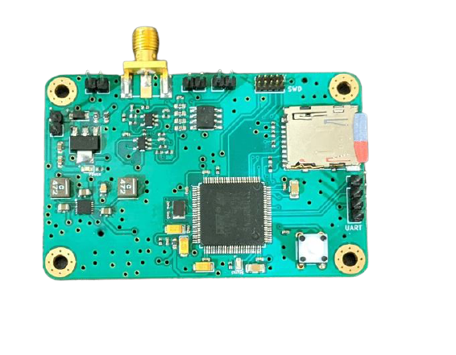

# PorpDAQ
STM32 Based design data acquisition recorder for harbour porpoises. The system is based on a 40dB bandpass preamplifier (90Khz - 150kHz). Records WAV file at a sampling rate of 400 KHz (V1) and 500 KHz (V2) and stores them to a microSD card. The preamplifier was designed using TI's filter designer tool. Preamp output is passed to a summing amplifier to keep signals within 0 - 3.3V with a 1.65V bias. There's a few iterations of the DAQ from the initial prototypes to improved designs. 

PorpDAQ has been designed to fit within a small multirotor UAV so current design weighs only 18g. PorpDAQ computes a 1024 point RFFT of incoming hydrophone signals and transmits signals within 90 - 150KHz over a UART Interface

## Rev 1 Board                         

The initial version of the DAQ was based on a STM32F746 chip and had a 400 KHz sample rate and a 12-bit ADC with a SD card write speed of about 20mbps. 

## Rev 2 Board

Rev 2 board comes with some improvements namely the the use of the STM32H743 chip, USB-C for power with the addition of a full speed interface. 500 KHz sample rate, SD Card write speed of ~35 Mbps with a 16-bit ADC and better SNR. Also slightly smaller footprint 
 

This repository mostly contains :
   - Hardware designs for the both revisions (circuits were simulated in MultiSim and designs were made in UltiBoard and Kicad)
   - Designs for the  different prototypes used.
   - A CM4-based design to integrate PorpDaq with a Pi4 Compute Module (WIP)
   - 3D designed case for the Rev 1 board 
   - Low level drivers and firmware (bare-metal version and FreeRTOS version for Rev1 and FreeRTOS version for Rev2)

## Structure
 - Firmware: Contains Custom Board FreeRTOS firmware and STM32F7 discovery board FreeRTOS and bare-metal firmware. Also contains H747 Disco Board firmware.  Please note bare-metal firmware currently has a UART TX bug preventing data from being transmmitted over the UART line.
 - Hardware: contains various designs and schematics for the board designs. **Rev 1** design is named `board_100pin` while  **Rev 2** design is named `h7_board`. 

 ## Citation (Bibtex)

` @article{Babatunde2020,
  doi = {10.3390/s20216064},
  url = {https://doi.org/10.3390/s20216064},
  year = {2020},
  month = oct,
  publisher = {{MDPI} {AG}},
  volume = {20},
  number = {21},
  pages = {6064},
  author = {Daniel Babatunde and Simon Pomeroy and Paul Lepper and Ben Clark and Rebecca Walker},
  title = {Autonomous Deployment of Underwater Acoustic Monitoring Devices Using an Unmanned Aerial Vehicle: The Flying Hydrophone},
  journal = {Sensors}
}`

## License
  MIT License Copyright 2020 Daniel Babatunde

